# tcpnode
<pre>
 ______    ______    __   __    ______   ______    ______    __        __        ______    ______   
/\  ___\  /\  __ \  /\ "-.\ \  /\__  _\ /\  == \  /\  __ \  /\ \      /\ \      /\  ___\  /\  == \  
\ \ \____ \ \ \/\ \ \ \ \-.  \ \/_/\ \/ \ \  __<  \ \ \/\ \ \ \ \____ \ \ \____ \ \  __\  \ \  __<  
 \ \_____\ \ \_____\ \ \_\\"\_\   \ \_\  \ \_\ \_\ \ \_____\ \ \_____\ \ \_____\ \ \_____\ \ \_\ \_\
  \/_____/  \/_____/  \/_/ \/_/    \/_/   \/_/ /_/  \/_____/  \/_____/  \/_____/  \/_____/  \/_/ /_/  
</pre>
Controller 프로그램으로써 Extender와 상호 tcp/ip를 통해 송수신하는 Server Applicatoin

## 시스템 구성 특징
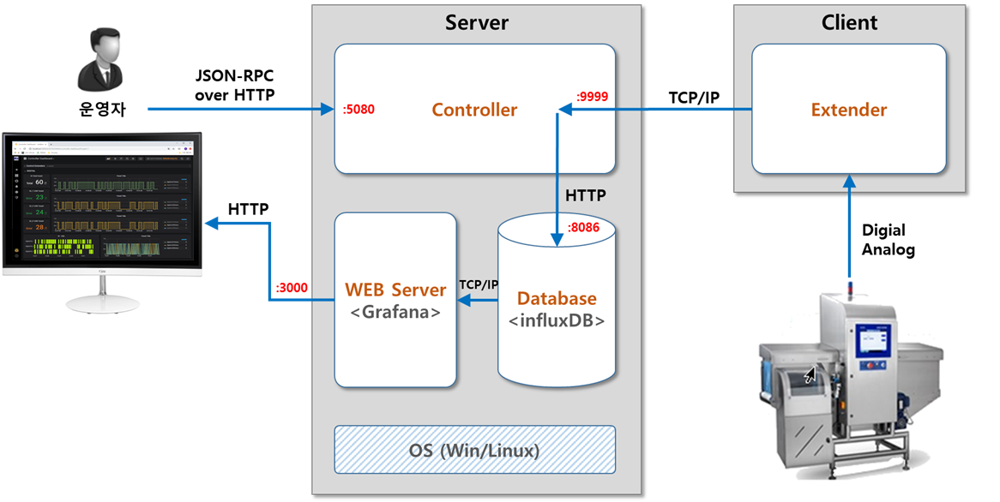
### 구성 요소
기능요소를 분리하여 Loose Coupled Architecture (구성요소간 상호 Dependency를 약결합으로 설계)를 적용하였으며, 
향후 시스템(서비스) 규모 변화에 능동적으로 변경/대응할 수 있도록 기능요소 교체와 HA(High Availability)를 위한 다중화 구성이 가능하도록 설계됨.
#### Controller
Extender와 상호 통신(tcp/ip)하고, 센서(접점 등) Signal을 Database로 저장하며, 운영자의 Extender 조작을 담당함.
##### 주요 기능
* 프로그래밍 언어 : Node.js (https://nodejs.org) 기반 ES6
* 이벤트 기반 설계 패턴 (Event Driven Design Pattern) 적용하여 적은 메모리와 상대적으로 빠른 성능 보장
* Cross Platform 환경 下 운영 가능 (Windows, Linux, macOS 등)
* pre-compile 없이 소스코드 수정 만으로 즉시 기능 반영 가능 (Executable Binary File Generation 및 운영 가능)
* RPC (Remote Procedure Call) 서버 Add-On (Web Browser HTTP-AJAX Call Enabled)으로, 모니터링 UI에서 직접 Extender 제어 가능
* 운영시 주요 정보를 별도 로그 파일로 관리 (일자별, 압축, 자동삭제 등)하여 이상상황에 대한 쉬운 파악 가능
* Extender를 대신할 Mock Up Client 기능 제공
##### 내부 구조 (간략버전)
* 폴더구조
<pre>
TCPNODE                     ▶▶ Applicaton Root
│  tcpnode-win-x64-1.2.1.exe    ▶▶ 윈도우 실행 파일
│  client-win-x64-1.2.1.exe     ▶▶ 윈도우 Mock Up Client 실행 파일
│  LICENSE
│  client.js                    ▶▶ (src) Mock Up Client
│  server.js                    ▶▶ (src) Controller Main
│  startup.bat                  ▶▶ 실행 Batch 파일
│  
├─frame                     ▶▶ (src) TCP/IP Telegram Defination
│      common.js
│      current.js
│      digital.js
│      hello.js
│      index.js
│      ir.js
│      notify.js
│      relay.js
│      serial.js
│      system.js
│      
├─influx                    ▶▶ (src) Database Configuration & Query
│      config.js
│      currentInflux.js
│      digitalInflux.js
│      helloInflux.js
│      index.js
│      systemInflux.js
│      
├─logger                    ▶▶ (src) Log File Handling
│      logger.js
│      
├─network                   ▶▶ (src) RCP Server Configuration & Services
│      getutil.js
│      rpc.js
│      rpcauth.js
│      rpcclient.js
│      rpcserver.js
│      
├─worker                    ▶▶ (src) Extender Signal Handling & Services
│       currentWorker.js
│       digitalWorker.js
│       helloWorker.js
│       index.js
│       notifyWorker.js
│       serialWorker.js
│       systemWorker.js
│       
└─logs                      ▶▶ Log Files
       2019-07-02-logs.log
       2019-07-03-logs.log
</pre>

#### Monitoring Web Server (Grafana)
Web Server를 포함하는 모니터링 UI를 제공. 운영자는 웹브라우저로 접속하여 모니터링 및 제어를 수행함.
* Grafana (https://grafana.com/)
* OpenSource License : Apache 2.0 
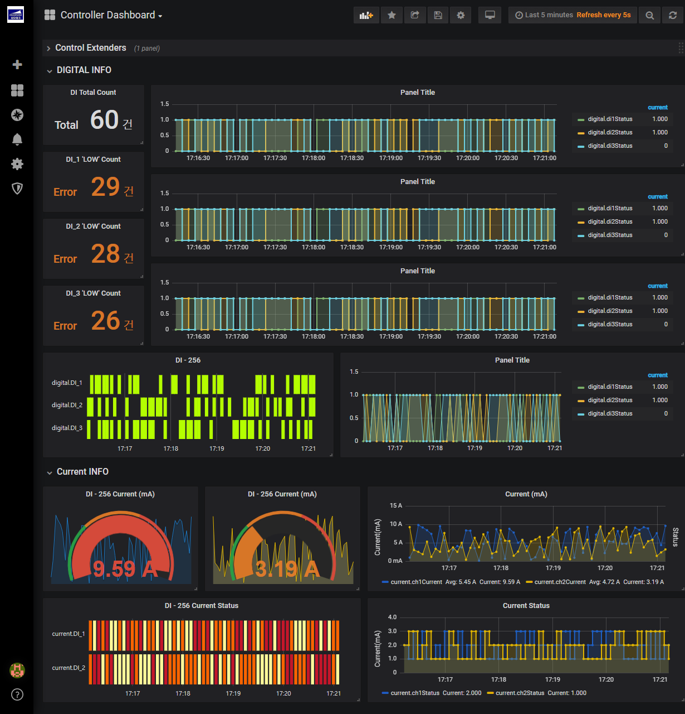
##### 주요 기능
* 다양하고 미려한 Monitoring Panel (Graph 등) 제공
* 시스템 및 데이터 형태에 어울리는 자유로운 UI 구성 관리기능 제공
* 모바일 환경 모니터링 기능 제공 
* 다양한 DBMS 지원
* Web Server 제공으로 장소에 구애받지 않는 쉬운 접근성 제공 (웹브라우저)
* 자체 DB 내장(embeded)
* 사용자 정의 Panel 작성 가능 (TcpNode Controller 개발완료)
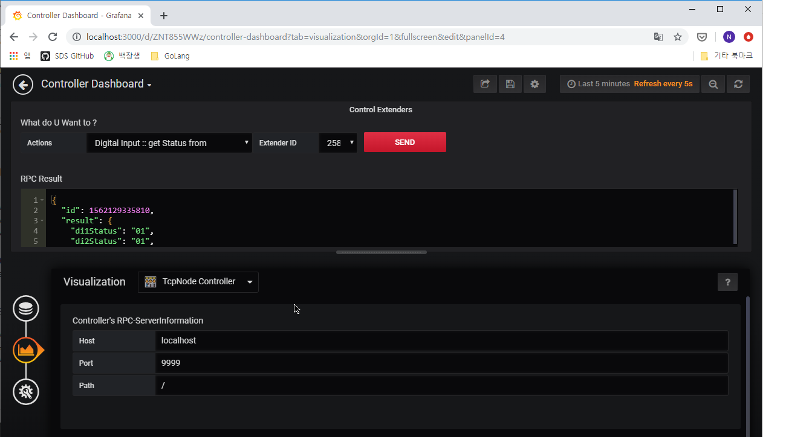

#### Database (InfluxDB)
시계열 데이터를 저장하는 데이터베이스 시스템이며, Extender에서 발생하는 모든 Signal 데이터를 Controller를 통해 저장함.
저장된 데이터는 모니터링 UI (Grafana) 를 통해 관제화면에 표출됨.
* InfluxDB (https://github.com/influxdata/influxdb)
* OpenSource License : MIT
##### 주요 기능
* 시계열 데이터 보관 및 관리에 최적화된 데이터베이스
* 데이터 최적화 관리 기능으로 최소한의 저장용량 사용
* 다양한 데이터 분석 및 집계 (Aggregation) Query 제공
* 범용적인 웹(HTTP) 접근 환경 제공
* 클러스터링 및 데이터 압축/자동삭제 등 다양한 운영환경 편의기능 제공 

## Screenshots
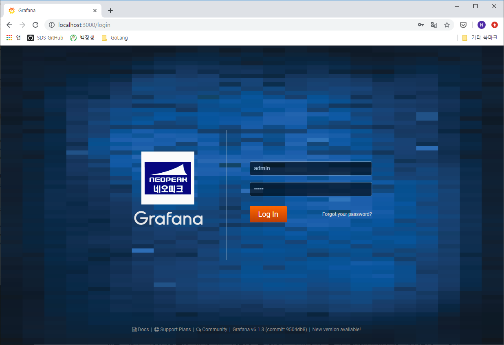
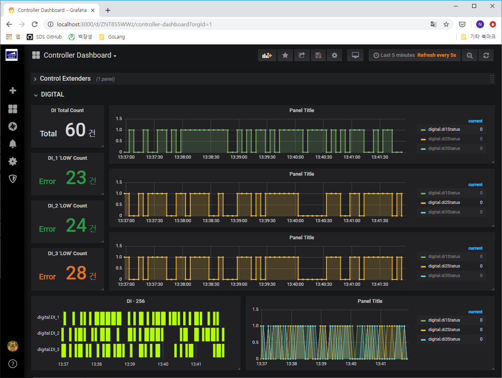
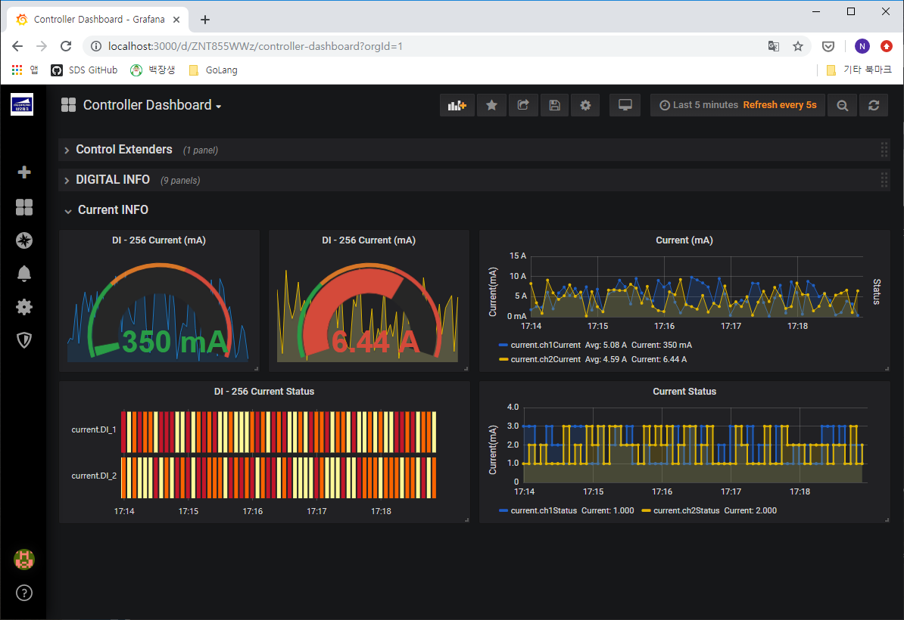
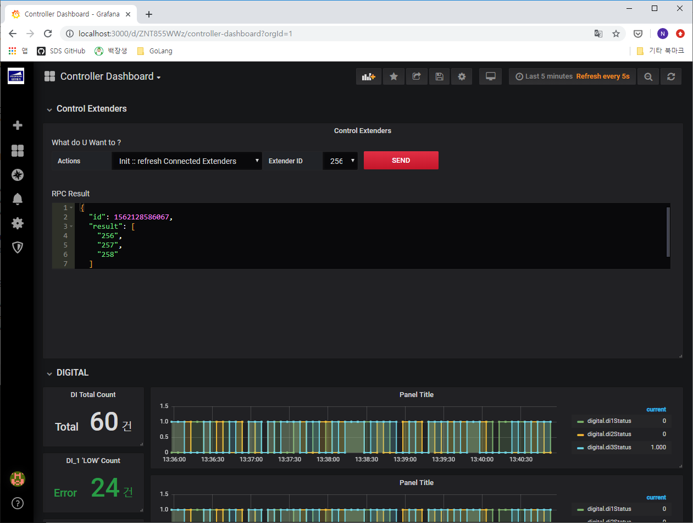
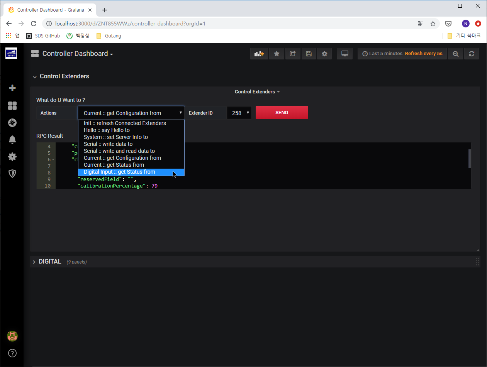
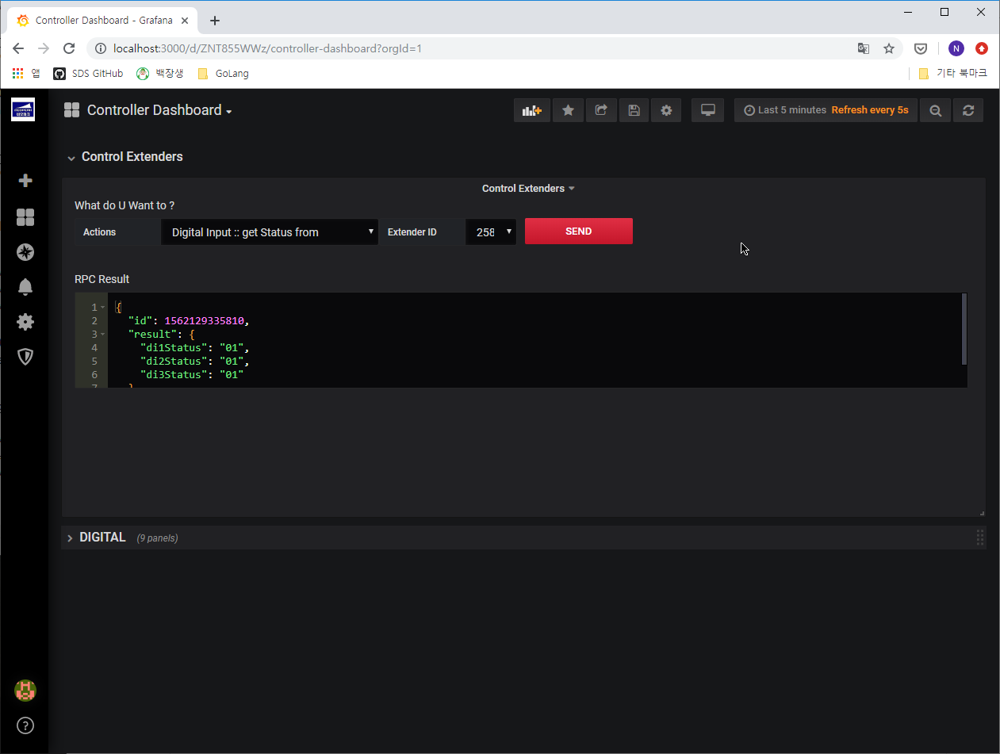
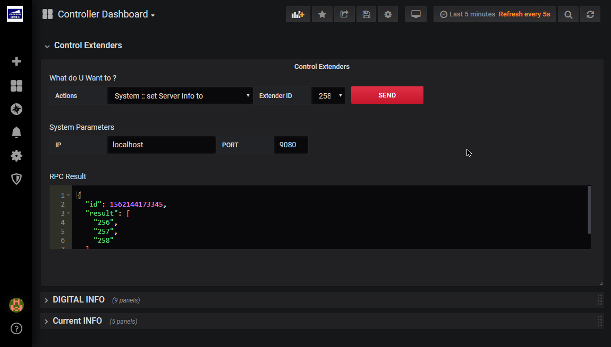
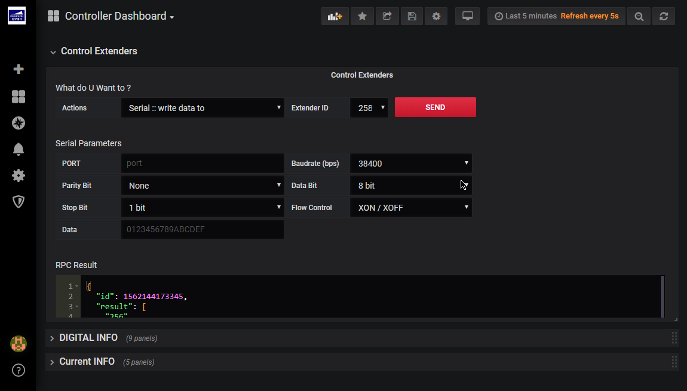
